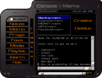

## Console\. The Personal Organiser For Your PC

### Description

This is Console. The personal organiser for

your PC.

Features include:

- Media Player capable of playing wavs, mp3s mpegs, avis and

most other formats.

- Notes section.

- Memos.

- Alarm capable of playing a sound or shutting down the

computer.

- Playlist editor/player with random option.

- Quick access to registry, control panel, cd player and other

Windows programs.

- Net search option. On Yahoo or Astalavista.

- Favourite directories feature, for quick access to 5 of your

most frequently used directories

- Favourite programs section.

- Always on top feature.

- Borderless form that is moveable.

- System tray icon.

- Volume control and mute option.

Many thanks to the author of CTARS-PADD for the idea and some

features!! This can also be found on Planet Source Code.
 
### More Info
 

             |
---                |---
**Submitted On**   |2000-06-29 19:25:12
**By**             |[James Compton](https://github.com/Planet-Source-Code/PSCIndex/blob/master/ByAuthor/james-compton.md)
**Level**          |Intermediate
**User Rating**    |4.0 (28 globes from 7 users)
**Compatibility**  |VB 5\.0, VB 6\.0
**Category**       |[Complete Applications](https://github.com/Planet-Source-Code/PSCIndex/blob/master/ByCategory/complete-applications__1-27.md)
**World**          |[Visual Basic](https://github.com/Planet-Source-Code/PSCIndex/blob/master/ByWorld/visual-basic.md)
**Archive File**   |[CODE\_UPLOAD72866292000\.zip](https://github.com/Planet-Source-Code/james-compton-console-the-personal-organiser-for-your-pc__1-9382/archive/master.zip)

